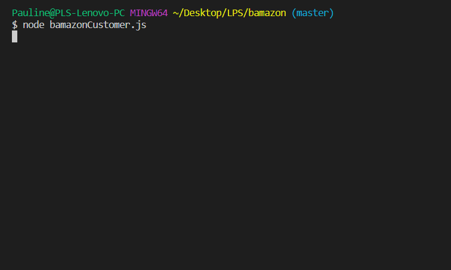

# bamazon

## Overview:

Using MySQL & Node.js, bamazon is an Amazon-like CLI app that takes orders from customers and depletes stock from the store's inventory as valid.

---

## Details:

1. Running `node bamazonCustomer.js` in the terminal will first display all of the items available for sale, including ids, names, and prices.

2. The app then prompts users with two messages:

   - The first asks them the ID of the product they would like to buy.
   - The second message asks how many units of the product they would like to buy.

3. Once the customer has placed the order, the app will check for a valid product ID and if the store has enough of the product to meet the customer's request.

   - If the product ID does not exist or if there is not enough quantity of a product, the app prevents the order from going through and prompts the customer to try again.

4. If an order is successful, the customer receives a receipt for the item and quantity purchased and the total cost.

5. the storefront will reflect the updated remaining quantity upon the next potential purchase.

---

## Demo:

### Successful Purchase

### Invalid Product ID

### Insufficient quantity

---

## Built with:

- [JavaScript](https://developer.mozilla.org/en-US/docs/Web/JavaScript) - High-level programming language.
- [MAMP](https://www.mamp.info/en/) - Local server environment.
- [MySQL Workbench](https://www.mysql.com/products/workbench/) - Visual database design tool that integrates SQL development, administration, database design, creation and maintenance into a single integrated development environment for the MySQL database system.
- [Node.js](https://nodejs.org/en/) - Open-source run-time environment that executes JS code outside of a browser.
- [Visual Studio Code](https://code.visualstudio.com/) - Source code editor developed by Microsoft.

#### npm packages used:

- [chalk](https://www.npmjs.com/package/chalk)
- [console.table](https://www.npmjs.com/package/console.table)
- [dotenv](https://www.npmjs.com/package/dotenv)
- [inquirer](https://www.npmjs.com/package/inquirer)
- [mysql](https://www.npmjs.com/package/mysql)

---

## Author:

- **Pauline Senh** - [plsenh](https://github.com/plsenh)
